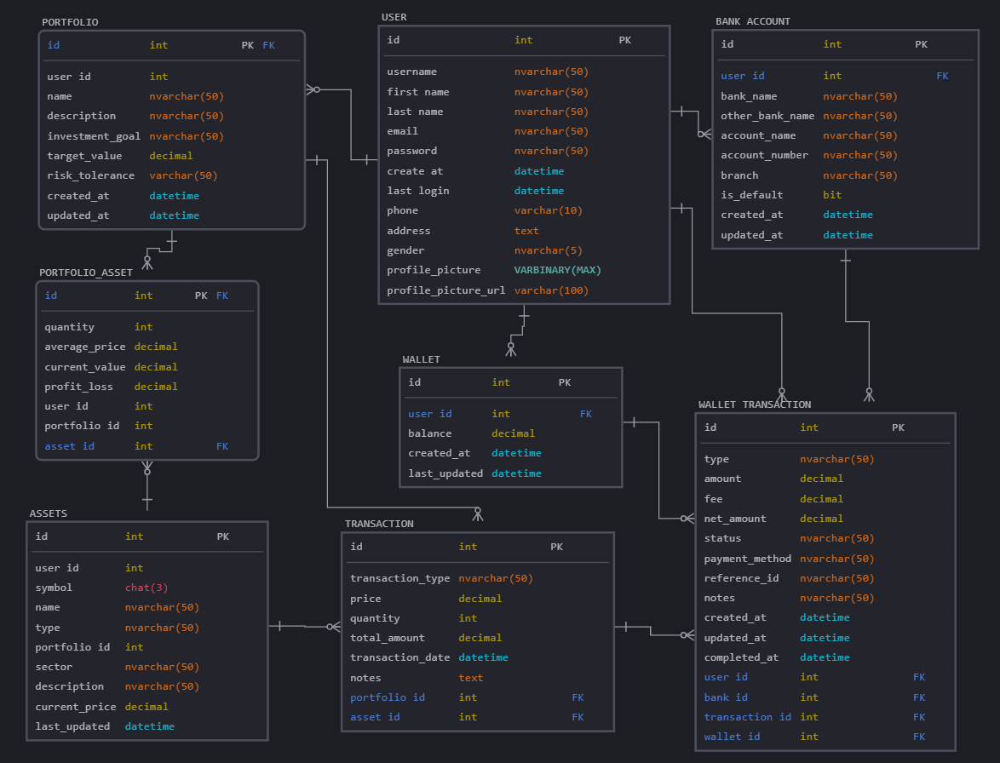

# Hệ Thống Quản Lý Danh Mục Đầu Tư

- **Thành viên nhóm**
- **Thành viên 1**: Hoa Xuân Hoàn - 22689381
- **Thành viên 2**: Đào Tiến Sang - 22705971
- **Thành viên 3**: Nguyễn Chí Trung - 22719231
- **Thành viên 4**: Nguyễn Trường Vương - 22642961

## Giới Thiệu
Hệ thống quản lý danh mục đầu tư giúp người dùng theo dõi, mua bán tài sản tài chính và quản lý danh mục đầu tư của họ. Hệ thống cung cấp các chức năng như nạp tiền vào ví, giao dịch tài sản, theo dõi biến động thị trường, và báo cáo hiệu suất danh mục.

## Công Nghệ Sử Dụng
- **Font-End**: HTML, CSS, JavaScript
- **Back-End**: Django (Python)
- **Database**: PostgreSQL

## Các Tính Năng Chính
- Đăng ký, đăng nhập, xác thực người dùng
- Quản lý ví tiền, nạp tiền vào ví
- Tạo và quản lý danh mục đầu tư
- Mua, bán tài sản tài chính
- Theo dõi biến động giá thị trường
- Xem báo cáo hiệu suất danh mục đầu tư

## Cấu Trúc Dự Án
```
.
├── docker-compose.yml              # Cấu hình Docker Compose
├── Dockerfile                      # Cấu hình Docker
├── entrypoint.sh                   # Script khởi động cho Docker
├── requirements.txt                # Các thư viện Python cần thiết
├── run.bat                         # Script khởi động cho Windows
├── run.sh                          # Script khởi động cho Linux/macOS
├── .env                            # Cấu hình biến môi trường
└── src/                            # Mã nguồn chính của dự án
    ├── manage.py                   # Tệp quản lý Django
    ├── config/                     # Cấu hình Django
    │   ├── settings.py             # Cài đặt Django
    │   ├── urls.py                 # URL chính của hệ thống
    │   ├── asgi.py                 # Cấu hình ASGI
    │   └── wsgi.py                 # Cấu hình WSGI
    ├── portfolio/                  # Ứng dụng chính
    │   ├── admin.py                # Cấu hình admin
    │   ├── apps.py                 # Cấu hình ứng dụng
    │   ├── models.py               # Định nghĩa model dữ liệu
    │   ├── views.py                # Xử lý logic và hiển thị
    │   ├── urls.py                 # Định nghĩa URL cho ứng dụng
    │   ├── tests.py                # Kiểm thử đơn vị
    │   └── migrations/             # Migration database
    ├── static/                     # Tài nguyên tĩnh (CSS, JS, hình ảnh)
    ├── media/                      # File người dùng tải lên
    └── templates/                  # Template HTML
        ├── base.html               # Template cơ sở
        └── portfolio/              # Template cho ứng dụng portfolio
            ├── home.html           # Trang chủ
            ├── dashboard.html      # Bảng điều khiển
            ├── login.html          # Trang đăng nhập
            └── register.html       # Trang đăng ký
```

## Mô Tả Các Thành Phần Chính

### Models
- `User`: Mô hình người dùng mở rộng từ Django User
- `Portfolio`: Danh mục đầu tư
- `Asset`: Tài sản tài chính
- `Transaction`: Giao dịch mua/bán
- `Wallet`: Ví tiền của người dùng
- `BankAccount`: Tài khoản ngân hàng liên kết

### Views
- `home`: Hiển thị trang chủ
- `dashboard`: Bảng điều khiển chính
- `register`, `login_view`: Xử lý đăng ký và đăng nhập
- `portfolio_*`: Các view xử lý danh mục đầu tư
- `transaction_*`: Các view xử lý giao dịch
- `wallet_*`: Các view xử lý ví điện tử

### Templates
- `base.html`: Template cơ sở chung
- `home.html`: Trang chủ với giới thiệu hệ thống
- `dashboard.html`: Bảng điều khiển người dùng
- `login.html`, `register.html`: Form đăng nhập và đăng ký

### Cấu trúc cơ sở dữ liệu



## Cài đặt
**Yêu cầu:**
PostgresSQL
Python 3 trở lên

- **Windows:** Chạy file `run.bat` bằng cách click vào file \
- **Linux/MacOS:** Chạy file `run.sh` bằng cách chạy lệnh `bash run.sh` \
- **Docker:** Chạy trên các hệ điều hành \
    Chạy lệnh: `dos2unix entrypoint.sh` để chuyển định dạng file entrypoint.sh thành định dạng Unix \
    Chạy lệnh: `docker-compose up --build` để build các Image \
    Truy cập trình duyệt ở địa chỉ: http://localhost:8000/